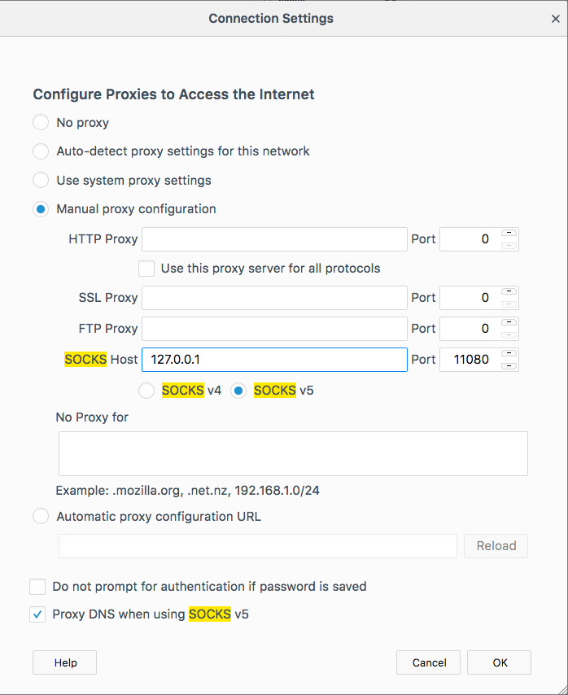
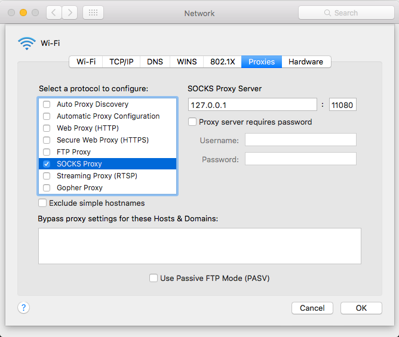
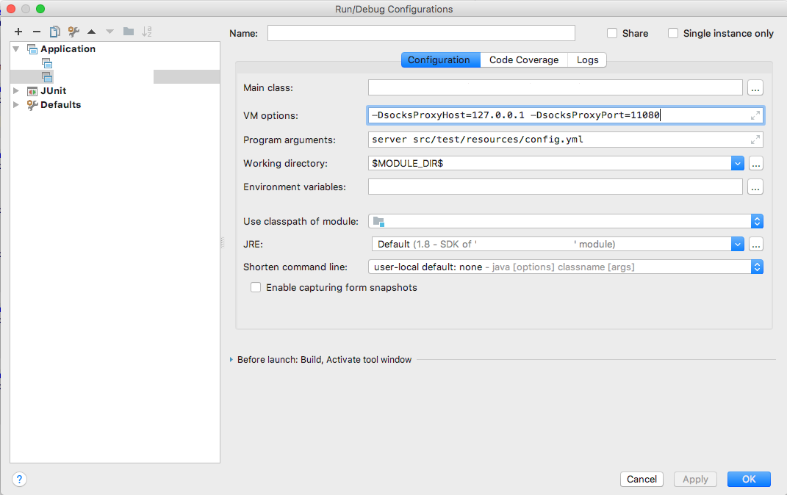

# SmartSOCKSProxy

SmartSOCKSProxy is a sock5 server/proxy and SSH manager which intelligently routes TCP connections to where they need to go 
without resorting to static SSH tunnels. SmartSOCKSProxy allows the client (web browser, java application) to use DNS names
without needing overrides in /etc/hosts. 

If a connection to a network segment is requested, SmartSOCKSProxy opens an SSH connection into that segment's bastion and routes 
the connection through SSH. In this case, SmartSOCKSProxy acts as a SOCKS5 client and uses SSH as the SOCKS5 server. 

## Requirements / Setup:

  - Build SmartSOCKSProxy on a mach: You may need to install xcode? if you don’t have it already. 
    - cd smartsocksproxy ; make clean ; make -j4 all
    - the above command should complete without any errors

  - You can ssh into your bastions without a password (if id_rsa is password protected, run “ssh-add ~/.ssh/id_rsa”)

  - Test SmartSOCKSProxy by running in the foreground:
    - ./smartsocksproxy -v -v -v -l -
    - if you want to specify the SOCKS5 port, add "-p &lt;port&gt;" to the command line

  - Copy and edit "run_smartsocksproxy.sh.example"; modify the path to smartsocksproxy you built above.
    Note: this example shell also contains static port-forwarding for access to Dev/QA/Prod Databases. 
    Because SQLDeveloper circumvents JVM SOCKS5 support.  

Running "./smartsocksproxy -h" provides a brief help summary. 

## Configure Your Browser or Application:

### Firefox

Preferences → Advanced → Network → Connection (Configure how Firefox connects...) Settings → Manual Proxy Configuration

*or*

Preferences → &lt;search for "socks"&gt; → Settings → Manual Proxy Configuration

Set:

  - SOCKS Host = 127.0.0.1
  - SOCKS Port = 11080
  - select SOCKS v5
  - No Proxy For: &lt;leave blank&gt;
    - SmartSOCKSProxy will handle connections to 127.0.0.1 just fine. 
  - Select "Proxy DNS when using SOCKS v5"

### Chrome 

  - Settings -&gt; &lt;search for "proxy"&gt; -&gt; Open proxy settings
  - continue for MacOS below
  
### MacOS

  - Open Network Settings
  - Select "Proxies" Tab
  - Select "SOCKS Proxy". Additional setting should appear to the right. 
  - Socks Proxy Server = 127.0.0.1 : 11080

### Java Applications

Add the following options to the JVM command-line: 

    -DsocksProxyHost=127.0.0.1 -DsocksProxyPort=11080

### /etc/hosts

SmartSOCKSProxy eliminates most requirements for /etc/hosts overrides. 

However, there is one case where SmartSOCKSProxy needs help: if you try to reach a DNS name which does not exist in the local-configured DNS, but the application 
resolves the DNS to an IP before opening the connection, it will fail on DNS resolution. IE: This all happens before SmartSOCKSProxy is 
contacted, so there's nothing SimpleSOCKSProxy can do about it.

To avoid this, we augment the local DNS with the missing DNS entries, or add them to /etec/hosts.

## Scenarios / Use Cases

SimpleSOCKSProxy is best understood through its use cases. 

### Connect to IP Address, Direct

If the IP address is directly addressible from the local network segment, connect to the IP address directly. 

### Connect to IP Address, Remote Segment

If the IP address resides within a remote segmented network: 

  - Open SSH connection to the remote's bastion, configured as a SOCKS5 server
  - SimpleSOCKSProxy, acting as a SOCK5 client, routes the connection through SSH to the destination

## Design Goals

### SimpleSOCKSProxy Design Goals: 

  - fast
  - stable
    - must never crash
    - handles all edge cases / error conditions elegantly, if not perfectly 
  - loggging
  - routing policy consolidated in a single place
    - easy to inspect and change

### SimpleSOCKSProxy Non-Goals: 
 
  - code doesn't need to be perfect; the project shouldn't grow very large
  - threading is used so the SOCKS5 protocol can be programmed using blocking I/O. This makes the SOCKS5 implementation 
    brittle, but easy to implement and read. 
  - IPv6 is unsupported
    - although most of the functionality is there, IPv6 is untested and not implemented in several areas. 

 
## Inspiration: 

  - https://github.com/armon/go-socks5/blob/master/socks5.go
  - https://github.com/isayme/socks5/blob/v2/src/callback.c

